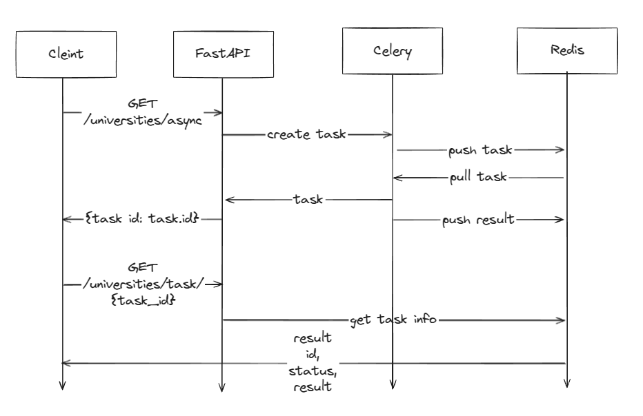
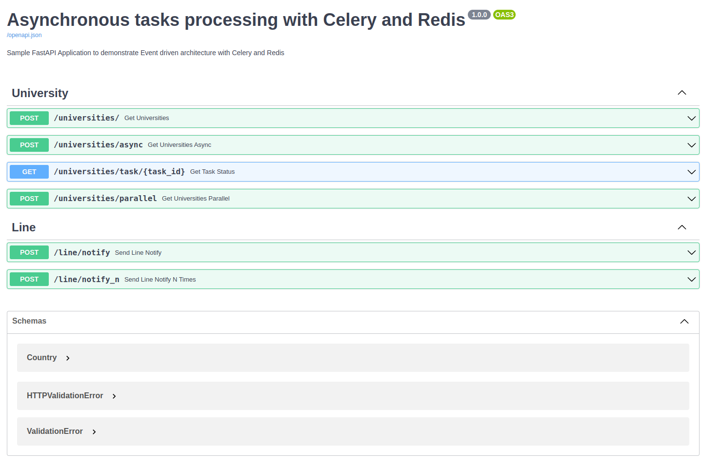
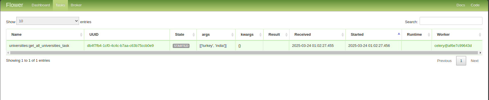

# Sample FastAPI Application to demonstrate Async architecture with Celery and Reddis

## Overview


## Original Implementation From

https://github.com/sumanentc/fastapi-celery-rabbitmq-application

## List of Changes:
- Dockerized the application
- Added Redis as a broker

## How to run
- build the docker image
    ```
    docker compose -f deployment/docker-compose.yaml build
    ```
- run the docker image
    ```
    docker compose -f deployment/docker-compose.yaml up -d
    ```

## Test with swagger
- visit http://localhost:9000/docs



## Visualize running tasks with flower
- visit http://localhost:5555


